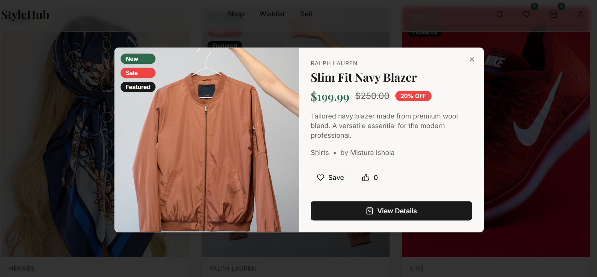
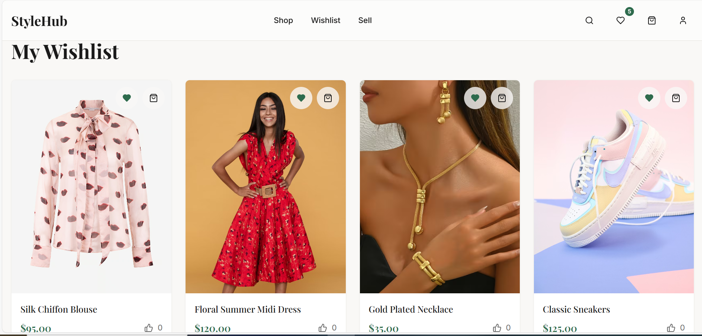
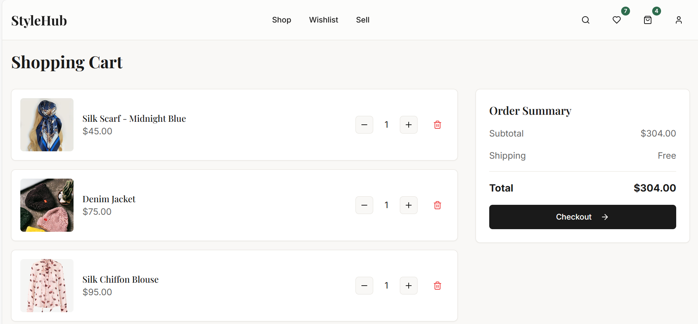
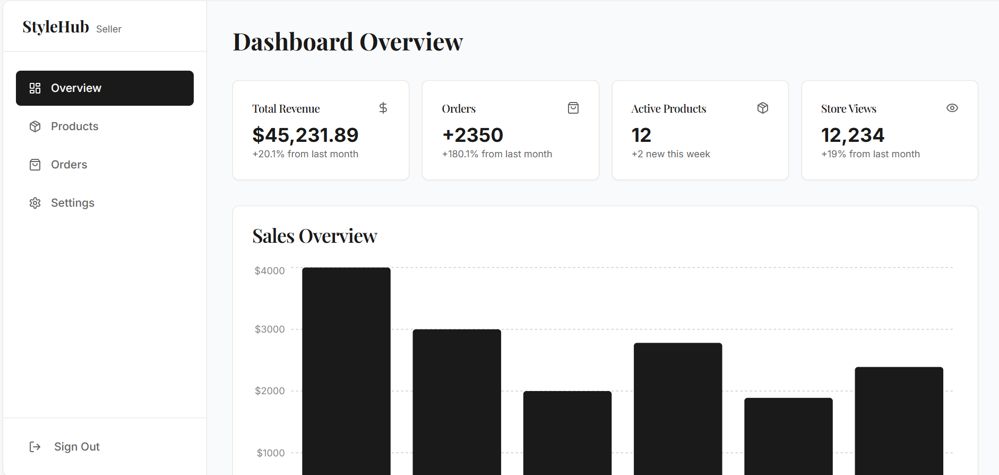

# StyleHub - Fashion Marketplace & E-commerce

A modern, responsive e-commerce marketplace built with React, Vite and Supabase. Features a complete shopping experience including product browsing, wishlist management, shopping cart and seller dashboard.

## Features

- **Authentication**: Secure Login and Signup with data validation and password visibility toggle.

- **Product Catalog**: Browse products with categories, search and details.

- **Shopping Cart**: Fully functional cart with quantity management and local storage persistence.

- **Wishlist**: Save your favorite items (requires login)

- **Seller Dashboard**: Manage your own products (Create, Read, Update, Delete)

- **Responsive Design**: Beautiful UI built with Tailwind CSS and Shadcn UI.


## Tech Stack

- **Frontend**: React, TypeScript, Vite
- **Styling**: Tailwind CSS, Shadcn UI
- **Backend/Database**: Supabase
- **State Management**: React Query, Context API


##  App Preview

| Home | Product | Wishlist |
|------|---------|----------|
|  |  |  |

| Cart | Seller Dashboard |  |
|------|------------------|--|
|  |  |  |


## Installation

1. **Clone the repository**
   ```bash
   git clone <repository-url>
   cd stylehub-app-react
   ```

2. **Install dependencies**
   ```bash
   npm install
   ```

3. **Set up Environment Variables**
   Create a `.env` file in the root directory and add your Supabase credentials:
   ```env
   VITE_SUPABASE_URL=your_supabase_url
   VITE_SUPABASE_ANON_KEY=your_supabase_anon_key
   ```

4. **Run the development server**
   ```bash
   npm run dev
   ```

## Verification

To ensure the project is ready for deployment:

```bash
# Run linting
npm run lint

# Build the project
npm run build
```

## License

This project is open source and available under the [MIT License](LICENSE).


## Developer

**Mistura Ishola**

[LinkedIn](https://www.linkedin.com/in/mistura-ishola/)
