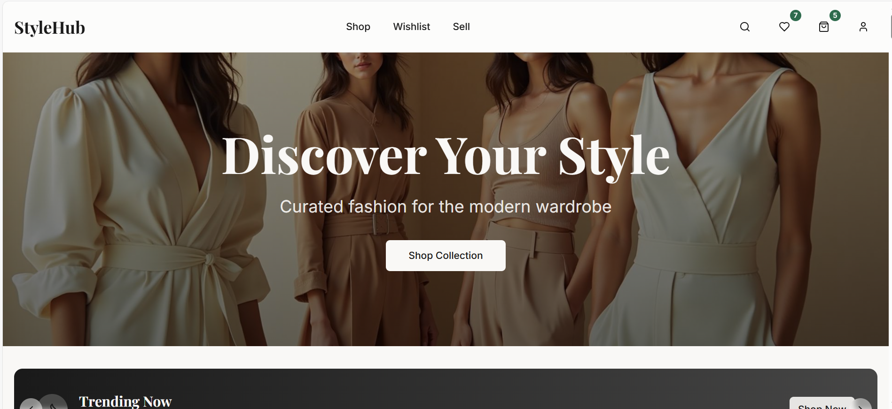
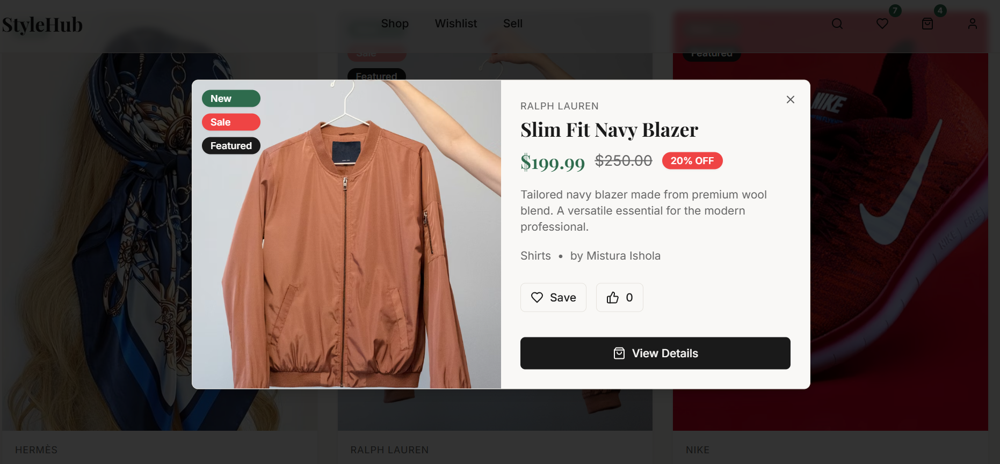
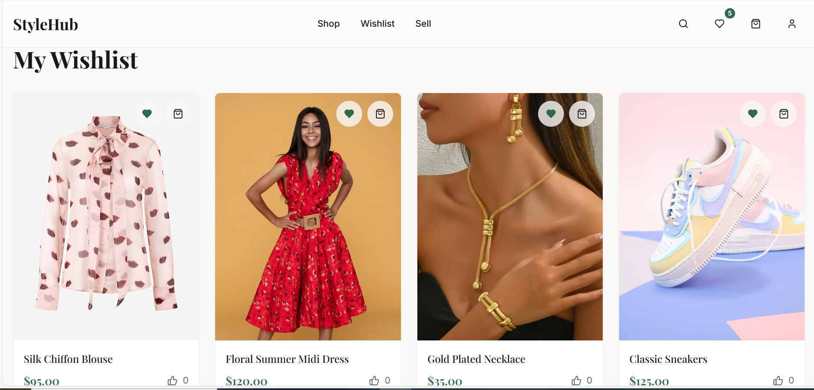
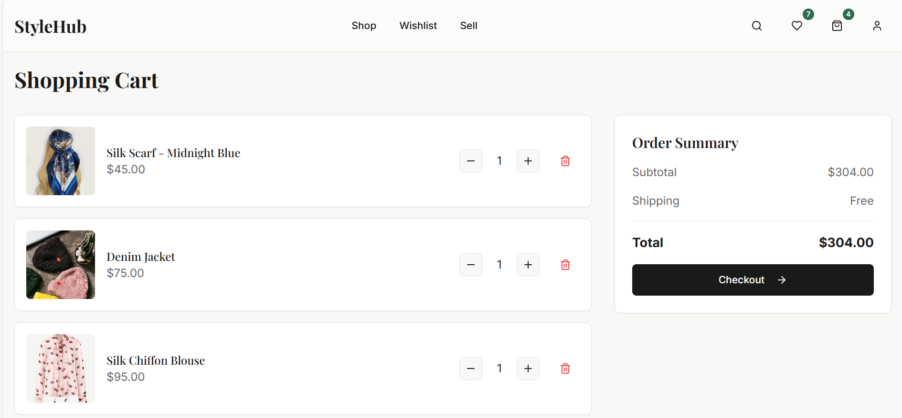
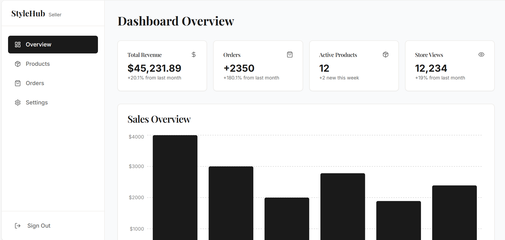

# StyleHub - Fashion Marketplace & E-commerce

StyleHub is a modern fashion e‑commerce web application built with React, TypeScript and Tailwind CSS. It allows users to browse, search and shop for fashion items with a responsive mobile-friendly design. The app also demonstrates backend integration with Supabase for authentication and data management and is deployed live on Vercel.

---

## Features

- **Authentication**: Secure Login and Signup with data validation and password visibility toggle.

- **Product Catalog**: Browse products with categories, search and details.

- **Shopping Cart**: Fully functional cart with quantity management and local storage persistence.

- **Wishlist**: Save your favorite items (requires login)

- **Seller Dashboard**: Manage your own products (Create, Read, Update, Delete)

- **Responsive Design**: Beautiful UI built with Tailwind CSS and Shadcn UI.

---

## Tech Stack

- **Frontend:** React (v18), TypeScript, Vite, React Router DOM v6  

- **Backend:** Supabase

- **UI & Styling:** Tailwind CSS, shadcn/ui (Radix UI), Lucide React, tailwindcss-animate, embla-carousel-react, sonner, next-themes  

- **Charts & Data Visualization:** Recharts  

- **State Management & Data Fetching:** React hooks, TanStack Query (React Query v5), React Hook Form + Zod  

- **Utilities:** date-fns, clsx, tailwind-merge, class-variance-authority, input-otp  

- **Deployment:** Vercel

---

##  App Preview

| Home | Product | Wishlist |
|------|---------|----------|
|  |  |  |

| Cart | Seller Dashboard |  |
|------|------------------|--|
|  |  |  |


---

## Installation

1. **Clone the repository**
   ```bash
   git clone https://github.com/MisturaDev/stylehub-app-react.git
   cd stylehub-app-react
   ```

2. **Install dependencies**
   ```bash
   npm install
   ```

3. **Set up Environment Variables**
   Create a `.env` file in the root directory and add your Supabase credentials:
   ```env
   VITE_SUPABASE_URL=your_supabase_url
   VITE_SUPABASE_ANON_KEY=your_supabase_anon_key
   ```

4. **Run the development server**
   ```bash
   npm run dev
   ```

---

## Verification

To ensure the project is ready for deployment:

```bash
# Run linting
npm run lint

# Build the project
npm run build
```

---

## License

This project is open source and available under the [MIT License](LICENSE)

---

## Developer

**Mistura Ishola**

[LinkedIn](https://www.linkedin.com/in/mistura-ishola/)
